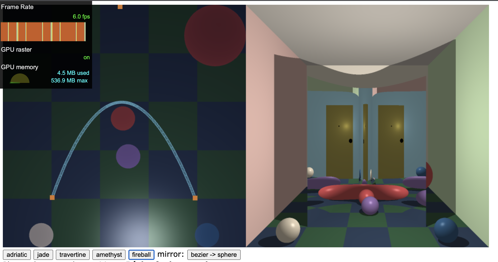

# FunHouse 

I did ray tracing by casting a ray tracing using subdivisions. 

Suppose `p`, `c`, `q` are three control points on the Bézier curve. 

Take the midpoint of `p` and `c`, called `l` and the midpoint of `c` and `q` called `r`, and the midpoint of `l` and `r` called `m`. 

The set of points `p`, `l`, `c` and the one of `c`, `r`, `q` act like standalone controls, and we can use the same schema to subdivide them further. 

It takes a while to load the page, and the FPS is pretty low though, due to I guess insufficient tracing and intersecting checking. I first compute the intersection of the ray and each panel, and then make sure the intersection is in the panel. 

Effect: 

